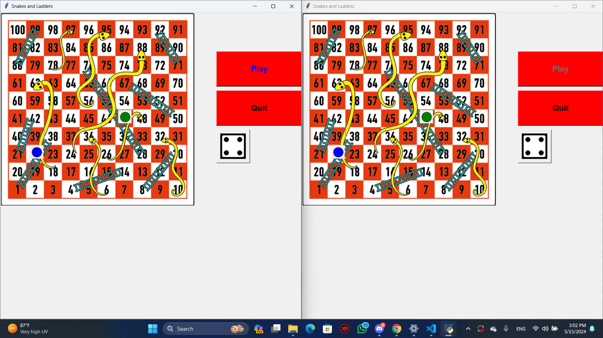

# Snakes and Ladders Game

This is a GUI application for playing Snakes and Ladders over a network using socket programming. It allows two clients to connect to a server and play the game together.

## Requirements
- Python 3.x
- Tkinter (Python's standard GUI package)

## How to Play
1. Run the `server.py` file to start the game server.
2. Run the `GUI.py` file twice to start two game clients.
3. Connect both clients to the server using the IP address and port displayed by the server.
4. Start the game from one of the clients.
5. Roll the dice, move your piece, and enjoy the game!

## Features
- GUI-based game interface using Tkinter.
- Networked gameplay using socket programming.
- Randomized dice rolling.
- Snakes and Ladders game logic.

## Screenshots

## Future Improvements
- Adding player names and customizable avatars.
- Implementing chat functionality between players.
- Enhancing the GUI with animations and better graphics.

